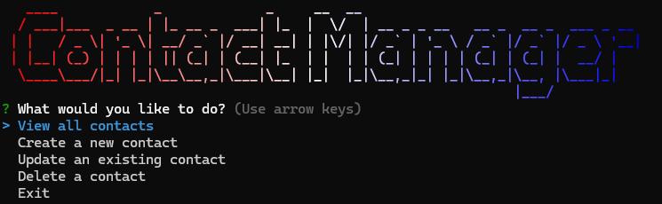

# Contact Manager Application



This is a simple command-line application that allows users to create, update, remove, and display contacts. Each contact has a first name, last name, email, phone number, and optional address. These contacts are stored in a Postgres database using Docker. The command line is built using Node.js, chalk, figlet, gradient-string, inquirer, and pg.

## Installation

To install this application, you will need to have Docker installed on your machine. You can download Docker from the [official website](https://www.docker.com/).

Once you have Docker installed, you can clone this repository and run the following command to build the Docker image:

```bash
cd contact-manager
docker compose up
```

You can have the Docker container running in the terminal or through the Docker Desktop application.

To get the application running, you will need to install the dependencies used in this project. You can do this by running the following commands:

```bash
npm install
```

```bash
cd front-end
npm install
```

## Usage

In the root directory, you can run the following command to start the command-line application:

```bash
node .
```